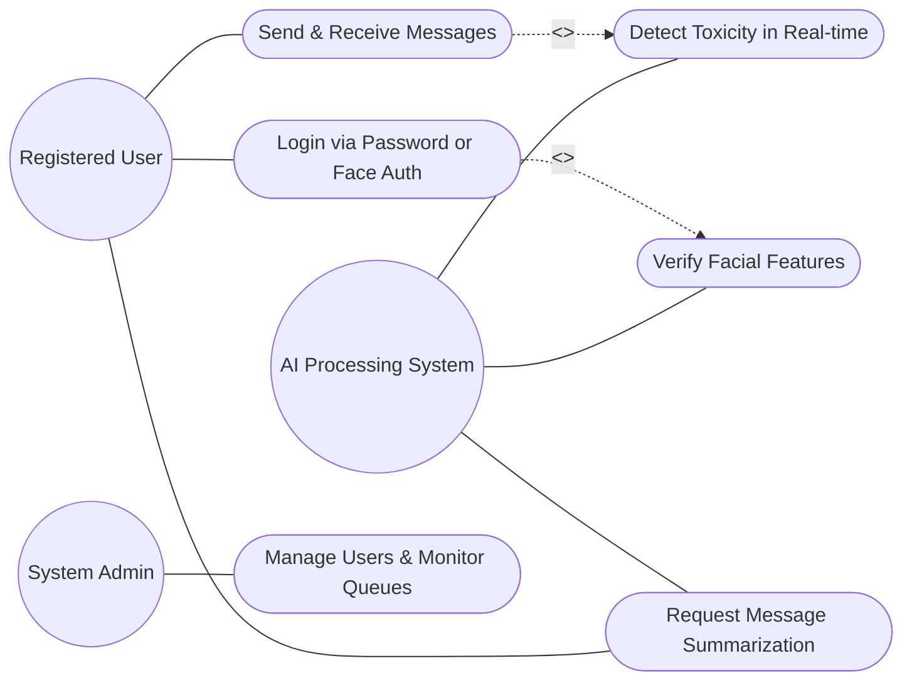
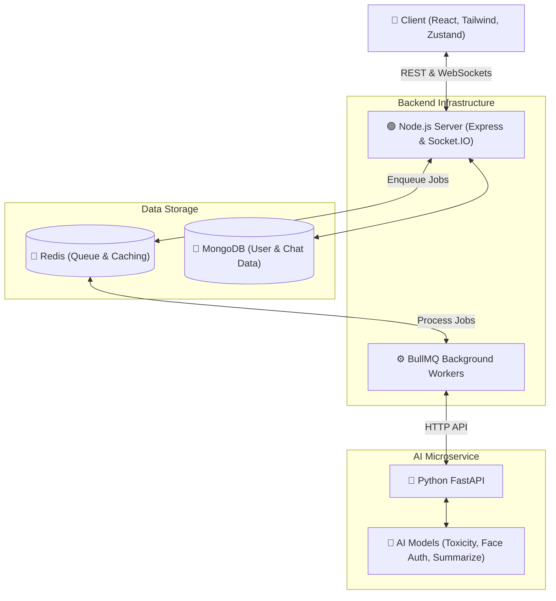

# Project Report On NexTalk: Real-Time Intelligent Messaging Platform

## ABSTRACT
NexTalk is a highly scalable, real-time messaging platform designed to provide a modern, secure, and profoundly interactive communication experience. In the era of digital communication, where information overload and online toxicity are prevalent issues, the project aims to redefine traditional chat applications by integrating an intelligent, independent AI microservice. This service powers advanced functionalities natively within the chat ecosystem, including real-time toxicity detection to automatically moderate conversations, secure face authentication for biometric user verification, and automated message summarization to distill lengthy chat histories into concise insights.

The platform is engineered using a robust, state-of-the-art technology stack. The frontend presentation layer leverages React, Tailwind CSS, GSAP, and Framer Motion to deliver a visually premium, fluid, and immersive user interface. On the server side, a Node.js backend utilizing Express and Socket.IO facilitates instantaneous, low-latency message delivery and presence management. To prevent the heavy computational demands of artificial intelligence from blocking the main event loop, all AI operations are offloaded via a Redis-backed BullMQ job queue to a dedicated Python FastAPI microservice utilizing DeepFace and Hugging Face Transformer models. 

By employing a decoupled, modular architecture paired with advanced global state management through Zustand and React Query, NexTalk addresses modern digital messaging challenges head-on. It successfully balances lightning-fast real-time interactions with heavy-duty machine learning processing, ultimately prioritizing user security, digital well-being, and sustained engagement in a dynamic communication environment.

---

## CHAPTER 1: INTRODUCTION

### 1.1 BACKGROUND OF THE PROJECT
In recent years, the necessity for instant communication platforms has surged. However, traditional messaging apps often struggle with automated moderation, secure authentication, and managing long, dense conversations. With the rapid advancement of artificial intelligence and real-time web socket technologies, users now expect intelligent, automated, and secure features embedded seamlessly into their daily communication tools.

### 1.2 PROBLEM DEFINITION
Users frequently encounter challenges in digital communication, including exposure to toxic or hateful language, unauthorized access to user profiles, and information overload from lengthy discussion threads. Existing tools often lack specialized, automated moderation or rely on generic, third-party implementations that compromise privacy and latency. 

### 1.3 MOTIVATION FOR THE PROJECT
The motivation behind NexTalk is to build an intelligent, lag-free communication bridge. The goal is to elevate the messaging experience by offering rapid, AI-powered assistance for content moderation (toxicity detection), advanced security (face authentication), and conversation insight extraction (message summarization) without sacrificing performance.

### 1.4 OBJECTIVES AND SCOPE OF THE PROJECT
* To provide an interactive, real-time messaging platform using WebSockets (Socket.IO).
* To implement local AI-powered models for automated toxicity detection to foster healthy conversations.
* To introduce face authentication as a reliable, secure alternative for user login and verification.
* To provide message summarization capabilities for quick reviews of lengthy chat histories.

---

## CHAPTER 2: LITERATURE REVIEW

### 2.1 EXISTING SOLUTIONS
Current solutions like WhatsApp, Telegram, or standard web chats provide robust real-time messaging but often limit the usage of deep, integrated AI features directly inside the client without external bots. They primarily focus on basic text delivery and traditional password or SMS-based authentication, often lacking automated sentiment analysis or real-time toxic message blocking natively built into the core message flow.

### 2.2 COMPARATIVE ANALYSIS
| Platform | Real-Time Chat | Auto-Summarization | Native Toxicity Block | Face Authentication |
|----------|----------------|--------------------|-----------------------|---------------------|
| Standard Web Chats | Yes | No | No | No |
| Third-Party Chat Bots | Limited | Yes | Limited | No |
| **NexTalk** | **Yes** | **Yes** | **Yes** | **Yes** |

### 2.3 HOW NEXTALK DIFFERS
NexTalk enhances the communication experience by integrating an independent, high-performance Python microservice directly into the backend pipeline via BullMQ and Redis. Unlike standard platforms, it inherently focuses on maintaining a non-toxic environment and secure, futuristic biometric authentication natively, providing users and admins with an inherently safe ecosystem.

---

## CHAPTER 3: SYSTEM ANALYSIS

### 3.1 FUNCTIONAL REQUIREMENTS
* User Registration and Authentic Authentication (Standard & Face Auth)
* Real-time one-on-one and group messaging
* Deep Integration with AI Service for Message Toxicity Detection
* AI-Based Conversation Summarization
* Task Queueing using Redis and BullMQ
* Dynamic UI with GSAP and 3D Shader Components

### 3.2 NON-FUNCTIONAL REQUIREMENTS
* **Usability:** Intuitive, visually premium interface utilizing Framer Motion and Tailwind CSS for seamless interaction.
* **Scalability:** The ability to efficiently handle multiple persistent WebSocket connection instances and asynchronous AI processing jobs.
* **Performance:** Minimal latency message delivery and fast inference times from the FastAPI AI service.
* **Security:** Use of Argon2 for password hashing, JWT for token management, TweetNaCl for encryption, and Helmet for HTTP security.

---

## CHAPTER 4: TECHNOLOGY STACK

| Category | Tools / Technologies | Purpose |
|----------|----------------------|---------|
| **Frontend** | React, Tailwind CSS, Framer Motion, GSAP, Three.js | Premium User Interface, 3D Graphics, Animations, and UX. |
| **Backend** | Node.js, Express, Socket.IO, BullMQ, Mongoose | Server-Side Logic, API Routing, Database Models, and Job Queues. |
| **AI/ML Service** | Python, FastAPI, PyTorch, Transformers, DeepFace | Toxicity analysis, message summarization, facial recognition. |
| **Database/Cache** | MongoDB Atlas, Redis (ioredis) | Primary data storage (NoSQL) and task queue/caching mechanism. |

**Reason for Selection:**
* **React + Tailwind + Framer Motion/GSAP:** Enables fast, dynamic, and visually stunning interactive UI development.
* **Node.js + Socket.IO:** Provides highly scalable, event-driven networking for real-time text transmission and presence channels.
* **Python + FastAPI + DeepFace/Transformers:** Ideal for state-of-the-art NLP and Computer Vision tasks, separated as a microservice so it does not block the single-threaded Node server.

---

## CHAPTER 5: SYSTEM DESIGN

### 5.1 USE CASE DIAGRAM
The Use Case Diagram below illustrates the primary actors and their interactions with the NexTalk platform's features, particularly emphasizing the integrated AI capabilities.

### 5.2 ARCHITECTURE DIAGRAM

The architecture follows a modern three-tier structure with a decoupled AI microservice to ensure the main application event loop remains unblocked during heavy model inference.

1. **Presentation Layer (Frontend)** – React + Tailwind CSS + Framer-Motion + GSAP
2. **Application Layer (Backend)** – Node.js (Express & Socket.IO) + BullMQ Workers
3. **AI Layer (Microservice)** – Python (FastAPI) + Transformers & DeepFace
4. **Data Layer (Database)** – MongoDB Atlas + Redis

### 5.3 MODULES/COMPONENTS
1. **User Authentication & Authorization Module:** Handles JWT token generation, Argon2 hashing, and routes login logic.
2. **Real-Time Communication Module (Socket.IO):** Manages connected clients, emits events for `receive-message`, `user-typing`, and active presence.
3. **Queue Processing Module (BullMQ):** Offloads heavy processing (like sending texts to the AI service) to background workers using Redis.
4. **AI Face Authentication Service:** Receives image streams, uses DeepFace to analyze face landmarks, and compares encodings for verification.
5. **AI Toxicity & Content Module:** Uses huggingface transformer models inside the Python API to score input strings for offensive terminology.
6. **Frontend Global Profile/UI Module:** Modular UI components built using Zustand for global app state and TanStack Query for caching HTTP requests.

---

## CHAPTER 6: TESTING

### 6.1 TYPES OF TESTING
* **Unit Testing:** Verified individual frontend states, hook logic, and Node.js REST API routes.
* **Integration Testing:** Tested the seamless flow between the React frontend, Node backend via Socket.IO, and the backend-to-Python AI microservice.
* **System Testing:** Checked the entire messaging pipeline functionality, from typing a message to it being scanned for toxicity and appearing on the receiver's screen.

### 6.2 TEST CASES AND RESULTS
| Test ID | Module | Expected Result | Status |
|---------|--------|-----------------|--------|
| TC01 | User Authentication | Successful login via standard credentials and Face Auth. | ✓ Successful |
| TC02 | Real-Time Messaging | Messages delivered to receiver instantly without page refresh. | ✓ Successful |
| TC03 | Toxicity Detection | Toxic messages correctly flagged/blocked before delivery. | ✓ Successful |
| TC04 | Job Queueing (BullMQ) | High volume message analysis queued properly without crashing Node server. | ✓ Successful |

---

## CHAPTER 7: RESULTS
*(Note: Placeholder for Application Screenshots)*

* **Landing Page:** Features advanced interactive UI elements, pixel-based hover effects, 3D shader components, and custom ClickSpark cursors.
* **Chat Dashboard:** A premium, dark-mode stylized interface showing real-time text bubbles, typing indicators, and user active statuses.
* **Authentication Page:** Provides dual options for login: secure password entry and Face ID scanning, enhanced with DotPattern stylistic borders.
* **Global Profile View:** A polished modal for viewing user profiles flawlessly without overflow, styled with unique, interactive UI patterns.

---

## CHAPTER 8: CHALLENGES FACED
* **AI Service Architecture & Port Conflicts:** During the integration of the Node.js backend and the Python AI frontend, standardizing environment port mapping (e.g. running Python on 8000 and Node on different ports) caused initial CORS and routing issues, which were resolved by standardizing `.env` profiles.
* **Managing Complex Real-Time State:** Processing asynchronous UI updates when a message is received required careful migration to robust state-management libraries (Zustand and React Query) to avoid infinite React re-renders.
* **Heavy Compute Blocking Node Event Loop:** Running AI NLP locally within Node would freeze the socket connections. **Solution:** Extracted AI tasks into an isolated FastAPI Python Microservice and utilized BullMQ/Redis for asynchronous job delegation.
* **UI/UX Visual Implementations:** Achieving the desired "premium, futuristic" aesthetic with custom WebGL/Three.js shaders and GSAP animations alongside React functional components led to complexity in lifecycle mounting. **Solution:** Careful use of `useEffect` refs and cleanup functions.

---

## CHAPTER 9: CONCLUSION AND FUTURE SCOPE

### 9.1 CONCLUSION
NexTalk successfully achieves its goal of transforming the traditional messaging experience into an interactive, highly efficient AI-powered platform. It bridges the gap between basic chat tools and intelligent assistants, delivering secure Face Authentication, proactive AI toxicity moderation, and real-time reliability. The separation of concerns between the Node messaging layer and the Python AI service allows for robust scalability and high performance.

### 9.2 FUTURE SCOPE
* Mobile App development using React Native or Flutter for cross-platform smartphone accessibility.
* Implementation of end-to-end (E2E) encryption for ultimate message privacy, utilizing the `tweetnacl` library currently in dependencies.
* Voice-based chat channels and real-time AI audio transcription.
* Enhanced multimodal AI features, such as image moderation and deeper sentiment analysis charts.

---

## REFERENCES
1. React Web Framework - https://react.dev/
2. Vite - https://vitejs.dev/
3. Socket.IO Real-Time Engine - https://socket.io/
4. Node.js & Express API - https://nodejs.org/
5. FastAPI (Python) - https://fastapi.tiangolo.com/
6. BullMQ & Redis - https://bullmq.io/
7. DeepFace Library - https://github.com/serengil/deepface
8. Hugging Face Transformers - https://huggingface.co/docs/transformers/
